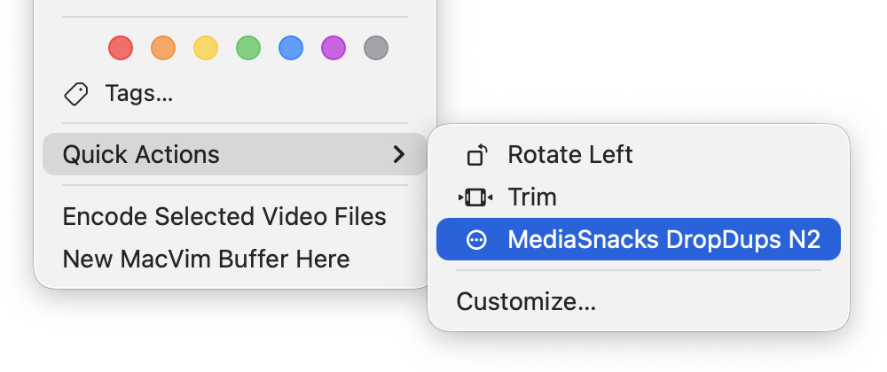

# mediasnacks

Utilities optimizing and preparing video and images for the web.


## Overview
**FFmpeg and Node.js must be installed.**

```shell
npx mediasnacks <command> <args>
```

### Commands
- `avif` Converts images to AVIF
- `sqcrop` Square crops images


- `resize` Resizes videos or images
- `edgespic` Extracts first and last frames
- `gif`: Video to GIF


- `dropdups` Removes duplicate frames in a video
- `framediff`: Plays a video of adjacent frames diff
- `hev1tohvc1`: Fixes video thumbnails not rendering in macOS Finder
- `moov2front` Rearranges .mov and .mp4 metadata for fast-start streaming
- `vconcat`: Concatenates videos
- `vdiff`: Plays a video with the difference of two videos
- `vsplit`: Splits a video into multiple clips from CSV timestamps
- `vtrim`: Trims video from start to end time


- `flattendir`: Moves unique files to the top dir and deletes empty dirs
- `qdir` Sequentially runs all *.sh files in a folder
- `seqcheck` Finds missing sequence number


- `dlaudio`: yt-dlp best audio
- `dlvideo`: yt-dlp best video


- `unemoji`: Removes emojis from filenames
- `rmcover`: Removes cover art


- `curltime`: Measures request response timings

### Globs
Glob patterns are expanded by Node.js.

```shell
mediasnacks avif file[234].png
# Expands to: file2.png, file3.png, file4.png
```

```shell
mediasnacks avif -- file[234].png
# Literal filename: "file[234].png"
```


---

## Commands

### Converting Images to AVIF
```shell
mediasnacks avif [-y | --overwrite] [--output-dir=<dir>] <images> 
```

<br/>

### Resizing Images or Videos
Resizes videos and images. The aspect ratio is preserved when only one dimension is specified.

`--width` and `--height` are `-2` by default:
- `-1` auto-compute while preserving the aspect ratio (may result in an odd number)
- `-2` same as `-1` but rounds to the nearest even number

```shell
mediasnacks resize [--width=<num>] [--height=<num>] [-y | --overwrite] [--output-dir=<dir>] <files>
```

Example: Overwrites the input file (-y)
```shell
mediasnacks resize -y --width 480 'dir-a/**/*.png' 'dir-b/**/*.mp4'
```

Example: Output directory (-o)
```shell
mediasnacks resize --height 240 --output-dir /tmp/out video.mov
```

<br/>

### Fast-Start Streaming Video
Rearranges .mov and .mp4 metadata to the start of the file for fast-start streaming.

**Files are overwritten**

```shell
mediasnacks moov2front <videos>
```
What is Fast Start?
- https://wiki.avblocks.com/avblocks-for-cpp/muxer-parameters/mp4
- https://trac.ffmpeg.org/wiki/HowToCheckIfFaststartIsEnabledForPlayback


<br/>

---

## Adding a macOS Quick Action




For example, for `dropdups -n2 file.mov`

- Open Automator
- Select: Quick Action
- Workflow receives current: `movie files` in `Finder.app`
- Action: `Run Shell Script`
```shell
export PATH="/opt/homebrew/bin"
for f in "$@"; do
  $HOME/bin/mediasnacks dropdups -n2 "$f"
done
```

It will be saved to `~/Library/Services` 

